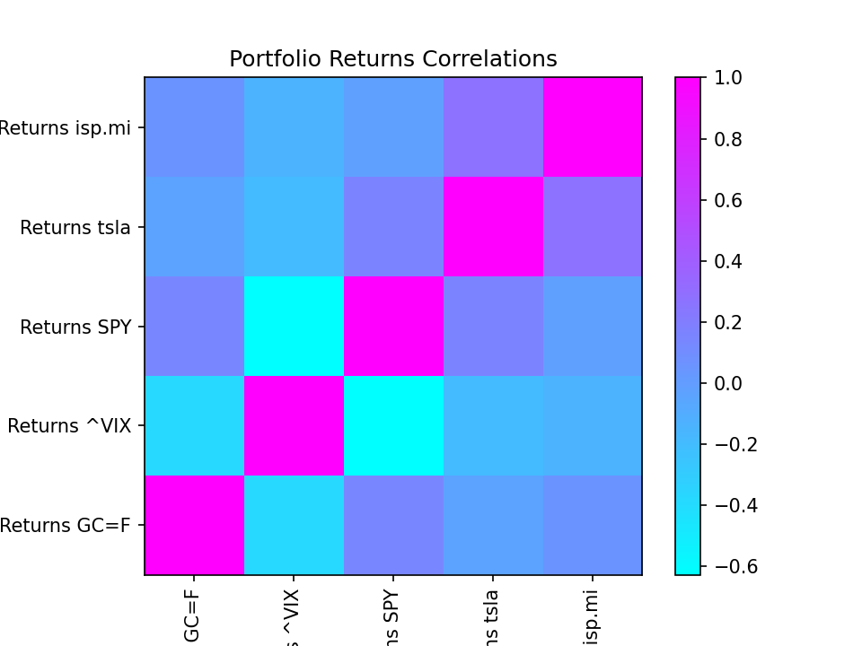
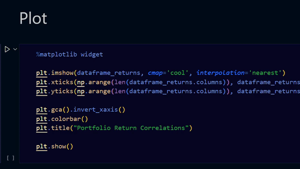
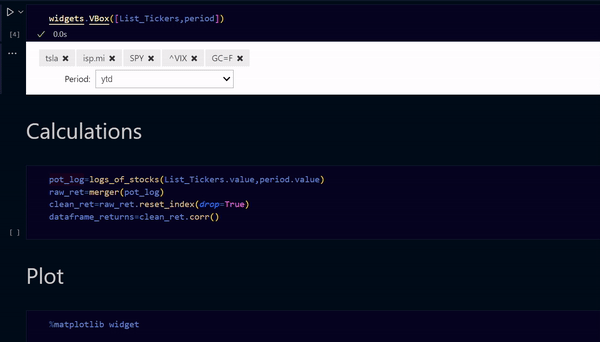

# Portfolio Heap Map

This notebook creates a heap map showing the correlation matrix of the asset returns of our choosing. The historical data comes from the Yahoo Finance API



## Setup

The notebook uses these two external libraries, it is very important to have the last version of `yfinance`.

```bash
!pip install yfinance
```

```bash
!pip install ipywidgets
```

In some types of notebooks (like Colab) the `%matplotlib` widget can create headaches so it is better to just comment it like this:



## How to use it

+ Run the `Setup` and `Interaction` groups
+ Choose the assets and the period of interest
+ Run the `Calculations` and `Plot` groups


